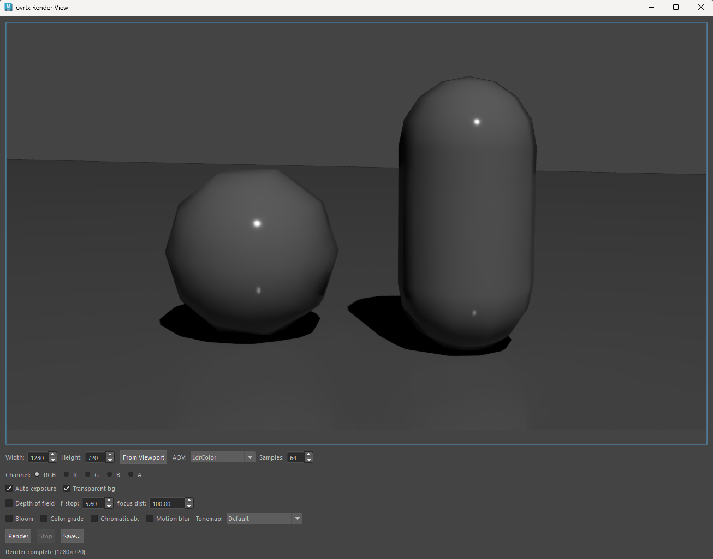
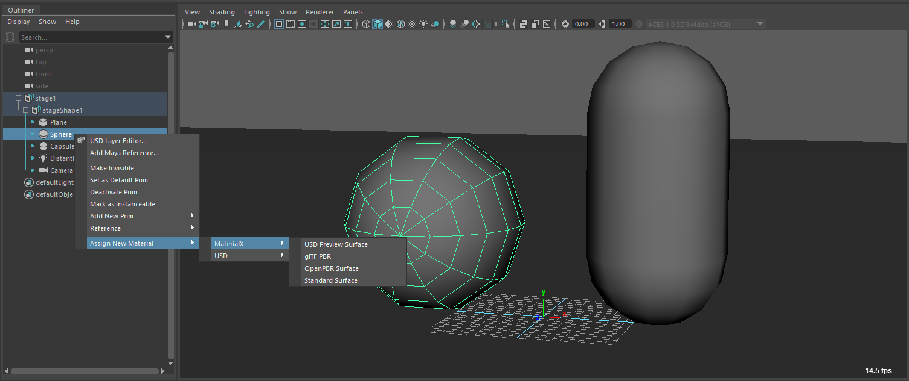
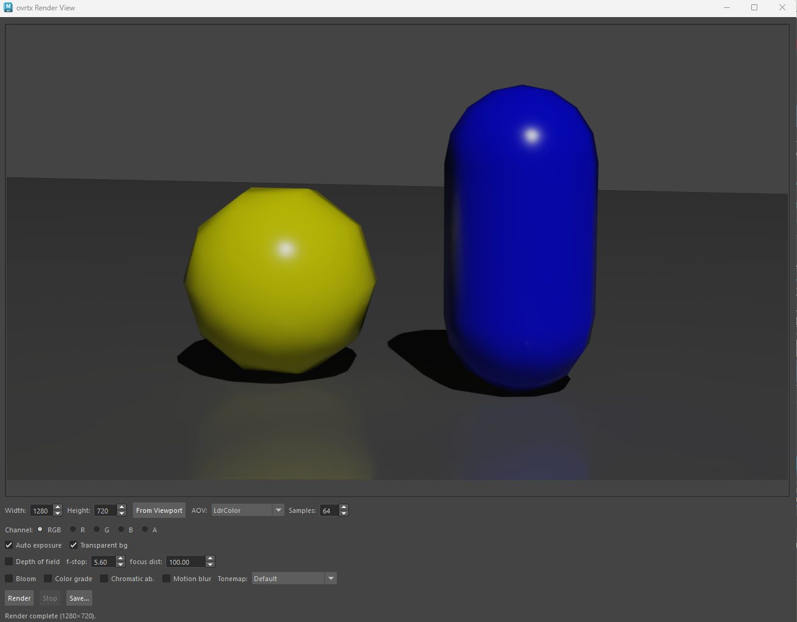

# Tutorial: Create a simple USD scene and render via Nvidia's OVRTX

### 1. Create a new stage

```python
import maya.cmds as cmds

import mayaUsd.ufe
import mayaUsd.lib
import mayaUsd_createStageWithNewLayer
import ufe
from pxr import UsdGeom, UsdLux, Gf

ps_path_str = mayaUsd_createStageWithNewLayer.createStageWithNewLayer()
stage = mayaUsd.lib.GetPrim(ps_path_str).GetStage()

UsdGeom.SetStageUpAxis(stage, UsdGeom.Tokens.y) 
UsdGeom.SetStageMetersPerUnit(stage, UsdGeom.LinearUnits.centimeters)
```

### 2. Ground Plane

```python
plane = UsdGeom.Cube.Define(stage, "/Plane")
plane.CreateSizeAttr(2.0)
plane_xform = UsdGeom.XformCommonAPI(plane)
plane_xform.SetScale(Gf.Vec3f(50.0, 1.0, 50.0))
plane_xform.SetTranslate(Gf.Vec3d(0.0, -1.0, 0.0))
```

### 3. Sphere and Capsule

```python
sphere = UsdGeom.Sphere.Define(stage, "/Sphere")
sphere.CreateRadiusAttr(2.0)
UsdGeom.XformCommonAPI(sphere).SetTranslate(Gf.Vec3d(-2.5, 2.0, 0.0))

capsule = UsdGeom.Capsule.Define(stage, "/Capsule")
capsule.CreateRadiusAttr(1.5)
capsule.CreateHeightAttr(3.0)
capsule.CreateAxisAttr(UsdGeom.Tokens.y)                 # stand it up along Y
UsdGeom.XformCommonAPI(capsule).SetTranslate(Gf.Vec3d(2.5, 3.0, 0.0))
```

### 4. Distant Light


```python
light = UsdLux.DistantLight.Define(stage, "/DistantLight")
light.CreateIntensityAttr(500.0)
light_xform = UsdGeom.XformCommonAPI(light)
light_xform.SetTranslate(Gf.Vec3d(0.0, 20.0, 0.0))
light_xform.SetRotate(Gf.Vec3f(-45.0, 30.0, 0.0))
```

### 5. Camera

```python
camera = UsdGeom.Camera.Define(stage, "/Camera")
camera.CreateFocalLengthAttr(35.0)
camera.CreateClippingRangeAttr(Gf.Vec2f(0.1, 100000.0))

target = Gf.Vec3d(0.0, 2.5, 0.0)
eye = Gf.Vec3d(7.0, 6.0, 16.0)
up = Gf.Vec3d(0.0, 1.0, 0.0)

view = Gf.Matrix4d(1.0)
view.SetLookAt(eye, target, up)
UsdGeom.Xformable(camera).AddTransformOp().Set(view.GetInverse())
```

### 6. Look through the camera

```python
cmds.lookThru(ps_path_str + ",/Camera")
```

### 7. Render with ovrtx

```python
if not cmds.pluginInfo("ovrtxMayaPlugin", query=True, loaded=True):
    cmds.loadPlugin("ovrtxMayaPlugin")
cmds.ovrtxRender()
```

Click "Render" button. `ovrtxRender` renders the first proxy shape with the **active viewport camera**
the USD `/Camera` we just looked through.

Note: there is currently no python bindings to launch the render from python code.

 

### Add New Materials

Apply `MaterialX` or `USD Preview Surface` shaders and Render again.

 


 